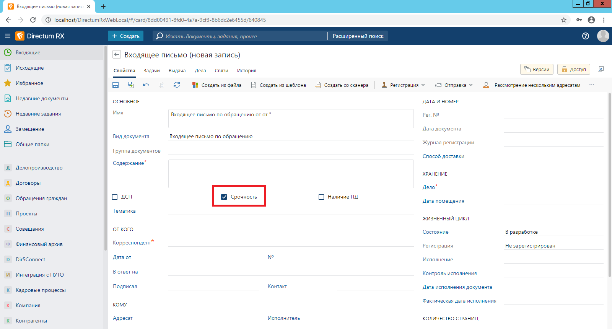

# ОГВ. Наработки с проектов внедрения. Примеры перекрытий
## Входящие
### Чек-бокс «Срочность»
#### Описание
В карточке входящего документа расположен чек-бокс «Срочность». Если чек-бокс «Срочность» установлен, то при отправке входящего документа на рассмотрение или на исполнение, для задач автоматически устанавливается высокая важность.

Реализация
В перекрытии входящего письма добавить свойства:
●	Срочность. Тип «Логический», имя свойства «IsUrgencyGD»;
В перекрытии события «Создание» входящего письма:
_obj.IsUrgencyGD = false;

В перекрытии события «Показ формы» задачи на исполнение поручения и задачи на рассмотрение документа:
base.Showing(e);

if (_obj.State.IsInserted && IncomingLetters.Is(_obj.DocumentsGroup.OfficialDocuments.FirstOrDefault()) && IncomingLetters.As(_obj.DocumentsGroup.OfficialDocuments.FirstOrDefault()).IsUrgencyGD == true)
  _obj.Importance = Sungero.RecordManagement.ActionItemExecutionTask.Importance.High;
Проверка на дубли во входящем письме
Описание
При заполнении полей карточки входящего письма: «Корреспондент», «Дата от», «№», «Наша орг.» производится проверка на наличие дублей по значениям данных полей. Если в результате проверки обнаружится карточка входящего письма с аналогичными значениями всех полей, то откроется диалоговое окно:
 
При нажатии на кнопку «Да» откроется список дублей. Также данная проверка производится при открытии карточки входящего письма. 
Реализация
В перекрытии входящего письма в событии «Изменение значение контрола» свойств «Вид документа», «Корреспондент», «Наша организация», «Дата от», «№»:

// Не забыть вызвать base.XXX 
if (Functions.IncomingLetter.HaveDuplicates(_obj,
                                           e.NewValue,
                                           _obj.BusinessUnit,
                                           _obj.InNumber,
                                           _obj.Dated,
                                           _obj.Correspondent))
{
  Functions.IncomingLetter.ShowDialogIfHaveDuplicates(_obj,
                                                      e.NewValue,
                                                      _obj.BusinessUnit,
                                                      _obj.InNumber,
                                                      _obj.Dated,
                                                      _obj.Correspondent);
}

Добавить в клиентские функции входящего письма:
/// 

/// Отобразить диалог для вывода дубликатов.
/// 

public void ShowDialogIfHaveDuplicates(Sungero.Docflow.IDocumentKind documentKind,
                                               Sungero.Company.IBusinessUnit businessUnit,
                                               string correspondentNumber,
                                               DateTime? dated,
                                               Sungero.Parties.ICounterparty correspondent)
{
var dialog = Dialogs.CreateTaskDialog(GD.MainSolution.IncomingLetters.Resources.ShowDublQuest, "", MessageType.Question, GD.MainSolution.IncomingLetters.Resources.Attention);

dialog.Buttons.AddYes();
dialog.Buttons.AddCancel();

if (dialog.Show() == DialogButtons.Yes)
  {
    var duplicates= Functions.IncomingLetter.Remote.GetDuplicates(_obj, documentKind, businessUnit, correspondentNumber, dated, correspondent);
    if (duplicates.Any())
      duplicates.ShowModal();
    else
      Sungero.Core.Dialogs.NotifyMessage(IncomingLetters.Resources.DuplicateNotFound);
  }
}
Добавить в серверные функции входящего письма:
/// 

/// Получить дубли письма.
/// 

/// <param name="letter">Письмо для проверки.</param>
/// <param name="documentKind">Вид письма.</param>
/// <param name="businessUnit">НОР письма.</param>
/// <param name="inNumber">Номер входящего.</param>
/// <param name="dated">Дата письма.</param>
/// <param name="correspondent">Корреспондент.</param>
/// <returns>Письма, дублирующие текущее.</returns>
[Remote(IsPure = true)]
public static IQueryable<IIncomingLetter> GetDuplicates(IIncomingLetter letter,
                                             Sungero.Docflow.IDocumentKind documentKind,
                                             Sungero.Company.IBusinessUnit businessUnit,
                                             string inNumber,
                                             DateTime? dated,
                                             Sungero.Parties.ICounterparty correspondent)
{
  return IncomingLetters.GetAll()
  .Where(l => documentKind != null && Equals(documentKind, l.DocumentKind))
  .Where(l => dated.HasValue && dated == l.Dated)
  .Where(l => businessUnit != null && Equals(businessUnit, l.BusinessUnit))
  .Where(l => !string.IsNullOrWhiteSpace(inNumber) && inNumber == l.InNumber)
  .Where(l => correspondent != null && Equals(correspondent, l.Correspondent))
  .Where(l => !Equals(letter, l));
}
Документы из области «Прочие», «Отмена» и «Основание» входящего письма автоматически попадают в область «Дополнительно» задачи на исполнение поручения
Описание
Есть копирование базового кода.
Документы, связанные с входящим письмом с типом связи «Основание», «Отмена» и «Прочие», автоматически вкладываются в область вложений задачи в раздел «Дополнительно» при отправке документа на рассмотрение или исполнение.
 
Реализация
В перекрытии входящего письма заменить обработчик действия «На исполнение поручением»:
    public override void SendActionItem(Sungero.Domain.Client.ExecuteActionArgs e)
    {
      // Принудительно сохранить документ, чтобы сохранились связи. Иначе они не попадут в задачу.
      _obj.Save();
      
      var hackTask = Sungero.Docflow.PublicFunctions.Module.CreateActionItemExecution(_obj);
      if (hackTask != null)
      {
        if (ActionItemExecutionTasks.Is(hackTask))
          EDMS.PublicFunctions.Module.AddRelationToAddendum(ActionItemExecutionTasks.As(hackTask).OtherGroup,
                                                               ActionItemExecutionTasks.As(hackTask).DocumentsGroup.OfficialDocuments.FirstOrDefault());
        hackTask.Show();
        e.CloseFormAfterAction = true;
      }
    }
Добавить публичную функцию в модуле:
/// 

/// Добавить в задачу все документы по связям кроме "Приложение" и документы с типом связи "Основание", "Отмена" и "Прочие".
/// <param name="groupAttachments">Группа вложения задачи.</param>
/// <param name="document">Документ.</param>
/// 

[Public]
public static void AddRelationToAddendum(Sungero.Workflow.Interfaces.IWorkflowEntityAttachmentGroup groupAttachments, Sungero.Docflow.IOfficialDocument document)
{
  if (document != null)
  {
    // Добавить в задачу ссылки на связанные с входящим письмом документы в группу вложений "Дополнительно" (кроме приложений).
    var relationsSource = Sungero.Content.DocumentRelations.GetAll()
      .Where(x => Equals(x.Source, document) && !Equals(x.RelationType.Name, Sungero.Docflow.PublicConstants.Module.AddendumRelationName));
    if (relationsSource.Any())
    {
      foreach (var relation in relationsSource)
        if (relation.Target != null && !groupAttachments.All.Contains(relation.Target))
          groupAttachments.All.Add(relation.Target);
    }
    
    Sungero.Docflow.PublicFunctions.OfficialDocument.AddRelatedDocumentsToAttachmentGroup(document, groupAttachments);
    
    // Добавить в задачу на рассмотрение ссылки на связанные с входящим письмом документы с типом связи "Основание", "Отмена" и "Прочие".
    var relationsTarget = Sungero.Content.DocumentRelations.GetAll().Where(x => Equals(x.Target, document) &&
                                                                           (Equals(x.RelationType.Name, EDMS.PublicConstants.Module.BasisRelationName) ||
                                                                            Equals(x.RelationType.Name, EDMS.PublicConstants.Module.CancelRelationName) ||
                                                                            Equals(x.RelationType.Name, Sungero.Docflow.PublicConstants.Module.SimpleRelationName)));
    if (relationsTarget.Any())
    {
      foreach (var relation in relationsTarget)
        if (relation.Source != null && !groupAttachments.All.Contains(relation.Source))
          groupAttachments.All.Add(relation.Source);
    }
  }
}
В задание на рассмотрение входящего документа помощником добавлена возможность вернуть регистратору документ
Описание
В карточку задания на подготовку проекта резолюции в рамках задачи на рассмотрение документа добавлен результат выполнения «Вернуть регистратору». Для выполнения задания с данным результатом пользователю необходимо указать причины возврата в текст задания.
 
При выполнении задания с данным результатом, делопроизводитель, отправивший документ на рассмотрение, получит задание исправить замечания:
Задание на исправление замечании имеет 2 результата выполнения:
•	При выполнении с результатом «Выполнить» сформируется задание на подготовку проекта резолюции;
•	При выполнении с результатом «Прекратить» задача прекратится.
Реализация
В перекрытии задачи на рассмотрение документа добавить задание

 
 

Перекрыть задание «Подготовка проекта резолюции» задачи на рассмотрение документа, добавить результат выполнения «Вернуть регистратору»:
  
Вычисления: 
    public virtual void ReturnToAuthor(Sungero.Workflow.Client.ExecuteResultActionArgs e)
    {
      if (string.IsNullOrWhiteSpace(_obj.ActiveText))
      {
        e.AddError(GD.MainSolution.PreparingDraftResolutionAssignments.Resources.NeedTextToRework);
        return;
      }
    }

    public virtual bool CanReturnToAuthor(Sungero.Workflow.Client.CanExecuteResultActionArgs e)
    {
      var task = DocumentReviewTasks.As(_obj.MainTask);
      return !Sungero.Docflow.Memos.Is(_obj.DocumentForReviewGroup.OfficialDocuments.FirstOrDefault()) && task.ClerkAddAI == null;
    }
Перекрыть схему задачи на рассмотрение документа:
 
В списке входящих на панель фильтрации добавлены параметры для фильтрации документов по годам
Описание
В список входящих писем добавлена возможность фильтрации документов по годам регистрации. С помощью фильтра в списке можно вывести список документов, зарегистрированных в текущем году, предыдущем, за всё время, либо указать интервал годов. 
 
Реализация
В перекрытии входящего письма в панели фильтрации добавить новую группу контролов «YearsPeriod»:

 
Для контрола «Year» выбрать формат даты «Только год»:
 

Изменить вычисления панели фильтрации: 
public override IQueryable<T> Filtering(IQueryable<T> query, Sungero.Domain.FilteringEventArgs e)
{
  if (_filter == null)
    return query;
  // Фильтрация по году.
  if (_filter.CurrentYear)
  {
    query = query.Where(x => x.DocumentDate.Value.Year == Calendar.Today.Year);
  }
  else if (_filter.PreviousYear)
  {
    query = query.Where(x => x.DocumentDate.Value.Year == Calendar.Today.Year - 1);
  }
  else if (_filter.PeriodYear)
  {
    var yearBegin = _filter.YearFrom != null ? _filter.YearFrom.Value.Year : Calendar.SqlMinValue.Year;
    var yearEnd = _filter.YearTo != null ? _filter.YearTo.Value.Year : Calendar.SqlMaxValue.Year;
    query = query.Where(x => x.DocumentDate.Value.Year >= yearBegin && x.DocumentDate.Value.Year <= yearEnd);
  }
  
  // Базовые фильры.
  query = base.Filtering(query, e);
  return query;
}

Поручения
Дополнительные сроки у соисполнителей
Описание
Есть копирование базового кода.
Автоматическое вычисление сроков исполнения поручений для соисполнителей в зависимости от сроков, установленных основному исполнителю. В варианте, представленном ниже, срок исполнения поручения для соисполнителей автоматически устанавливается на 1 рабочий день меньше, чем для основного исполнителя.
 
Реализация
В перекрытии задачи по исполнению поручений добавить свойство:
●	Срок. Тип «Дата», имя свойства «CoAssigneesDeadlineGD»;

В перекрытии события «Обновление формы» задачи по исполнению поручений:
var isCompoundActionItem = !(_obj.IsCompoundActionItem ?? false);
_obj.State.Properties.CoAssigneesDeadlineGD.IsVisible = isCompoundActionItem;

Изменение значения контрола CoAssigneesDeadlineGD:
    public virtual void CoAssigneesDeadlineGDValueInput(Sungero.Presentation.DateTimeValueInputEventArgs e)
    {
      if (e.NewValue != e.OldValue && e.NewValue.HasValue)
      {
        if (e.NewValue > _obj.Deadline)
          // Срок соисполнителей не может быть больше срока ответственного исполнителя.
          e.AddError(ActionItemExecutionTasks.Resources.CoAssigneesDeadlineError);
        
        if (e.NewValue < Calendar.Today)
          // Срок соисполнителей должен быть больше или равен текущей дате.
          e.AddError(ActionItemExecutionTasks.Resources.DeadlineIsLessCurrentDate);
        
        if (!Calendar.IsWorkingDay(e.NewValue.Value))
          // Срок выполнения соисполнителей выпадает на выходной день.
          e.AddWarning(ActionItemExecutionTasks.Resources.DeadlineIsNotWorking);
      }
            
      var parentAssignment = ActionItemExecutionAssignments.As(_obj.ParentAssignment);
      if (parentAssignment != null && parentAssignment.Deadline.HasValue && e.NewValue.HasValue && e.NewValue != e.OldValue && e.NewValue.Value > parentAssignment.Deadline.Value)
      {
        var mainActionItemIsOverdue = true;
        var deadline = _obj.CoAssigneesDeadlineGD;
        if (deadline.HasValue && deadline.Value.Date.CompareTo(Calendar.Today) == 0 && (deadline.Value.CompareTo(Calendar.Now) > 0 || deadline.HasValue && string.Equals(deadline.Value.ToShortTimeString(), "0:00")))
          mainActionItemIsOverdue = false;
        
        if (mainActionItemIsOverdue && Sungero.Docflow.PublicFunctions.Module.CheckDeadline(Calendar.Today, parentAssignment.Deadline))
        {
          // Основное поручение просрочено.  Дата проекта поручения превышает дату основного поручения - {0}.
          e.AddWarning(GD.MainSolution.ActionItemExecutionTasks.Resources.MainActionItemIsOverdueFormat(parentAssignment.Deadline.Value.ToUserTime().ToShortDateString()));
        }
        else
        { 
          // Дата проекта поручения превышает дату основного поручения - {0}.  
          e.AddWarning(ActionItemExecutionTasks.Resources.DeadlineSubDraftActionItemExecutionFormat(parentAssignment.Deadline.Value.ToUserTime().ToShortDateString()));
        }
      }
    }
Добавить разделяемую функцию в задаче по исполнению поручения:
    public void FillCoAssigneesDeadline(DateTime maxDeadline)
    {
      _obj.CoAssigneesDeadlineGD = Calendar.AddWorkingDays(maxDeadline, -1) < Calendar.Today ? Calendar.Today : Calendar.AddWorkingDays(maxDeadline, -1);
    }

В событии добавления в коллекцию соисполнителей: 
    public override void CoAssigneesAdded(Sungero.Domain.Shared.CollectionPropertyAddedEventArgs e)
    {
      base.CoAssigneesAdded(e);
      if (_obj.CoAssigneesDeadlineGD == null && _obj.Deadline != null)
        Functions.ActionItemExecutionTask.FillCoAssigneesDeadline(_obj, _obj.Deadline.Value);
    }

Изменение значения свойства «Срок» (Deadline):
    public override void DeadlineChanged(Sungero.Domain.Shared.DateTimePropertyChangedEventArgs e)
    {
      base.DeadlineChanged(e);
      if (e.NewValue != null && !_obj.IsCompoundActionItem.Value && _obj.CoAssignees != null && _obj.CoAssignees.Count() > 0)
        Functions.ActionItemExecutionTask.FillCoAssigneesDeadline(_obj, e.NewValue.Value);
    }

Перекрыть блок «Задачи на соисполнение» задачи по исполнению поручения (10 блок). В перекрытии скопировать текст базового обработчика и до строки «actionItemExecution.Start();» добавить код:
  actionItemExecution.Deadline = _obj.CoAssigneesDeadlineGD != null ? _obj.CoAssigneesDeadlineGD : _obj.Deadline;
  actionItemExecution.MaxDeadline = _obj.CoAssigneesDeadlineGD != null ? _obj.CoAssigneesDeadlineGD : _obj.Deadline;
        
  actionItemExecution.State.Properties.Deadline.IsRequired = false;
  actionItemExecution.State.Properties.CoAssigneesDeadlineGD.IsRequired = false;

Заполнение поля "Факт. дата" в карточке задачи по исполнению поручения
Описание
В карточку задачи по исполнению поручения добавлено поле «Факт. дата». Поле автоматически заполняется фактической датой исполнения поручения.
 
Реализация
В перекрытии задачи по исполнению поручения в коллекции «ActionItemParts» добавить свойство:
●	Факт. дата. Тип «Дата», имя свойства «ActualDate»;
В перекрытии задачи по исполнению поручений в блоке «Исполнение поручения» перекрыть событие конец блока:
    public override void EndBlock4(Sungero.RecordManagement.Server.ActionItemExecutionAssignmentEndBlockEventArguments e)
    {
      base.EndBlock4(e);
      // Заполнить фактическую дату завершения исполнения поручения.
      var compoundActionItem = ActionItemExecutionTasks.GetAll(t => t.ActionItemParts.Any(p => p.ActionItemPartExecutionTask.Id == _obj.Id)).FirstOrDefault();
      if (compoundActionItem != null)
      {
        var completed = e.CreatedAssignments.Select(a => a.Completed).OrderByDescending(a => a).FirstOrDefault();
        if (completed != null)
        {
          var str = compoundActionItem.ActionItemParts.Where(p => p.ActionItemPartExecutionTask.Id == _obj.Id).Cast<MainSolution.IActionItemExecutionTaskActionItemParts>().FirstOrDefault();
          str.ActualDate = e.Block.AbsoluteDeadline.HasTime()
            ? completed
            : Calendar.GetUserToday(e.Block.Performers.FirstOrDefault());
        }
      }
    }
В текст поручения дополнительно вставлять информацию об исполнителях
Описание
При старте задачи дополнительно к тексту поручения добавляется информация об исполнителях по данному поручению для быстрого просмотра исполнителей по поручению. Формат добавляемой информации: Исполнитель/соисполнитель/отв. Исполнитель: <Фимилия И.О.> (<Код НОР>) (Если код НОР не заполнен, то указывается наименование НОР).
 
Реализация
Доп. информация добавляется в поле поручение. Но что бы при копировании поручения доп. информация из копируемого поручения не подставлялась нужно сохранить текст поручения без доп. информации. Для этого нужно добавить новое скрытое свойство в перекрытии задачи по исполнению поручения:
●	Исходный текст поручения. Тип «Строка(1000)», имя свойства «ActionItemHide»;
В перекрытии задачи по исполнению поручений в событии до старта:
  base.BeforeStart(e);
  // Добавить исполнителя/соисполнителя/отв.исполнителя в поручение.
  // Определить ведущю задачу
  IActionItemExecutionTask mainTask;
  if (_obj.ParentAssignment != null && ActionItemExecutionAssignments.Is(_obj.ParentAssignment) &&
      ActionItemExecutionTasks.As(ActionItemExecutionAssignments.As(_obj.ParentAssignment).Task).CoAssignees.Where(x => Employees.Equals(x.Assignee, _obj.Assignee)).Any())
  {
    mainTask = ActionItemExecutionTasks.As(ActionItemExecutionAssignments.As(_obj.ParentAssignment).Task);
  }
  else if (_obj.ParentTask != null && ActionItemExecutionTasks.Is(_obj.ParentTask) &&
           ActionItemExecutionTasks.As(_obj.ParentTask).ActionItemParts.Where(x => Employees.Equals(x.Assignee, _obj.Assignee)).Any())
  {
    mainTask = ActionItemExecutionTasks.As(_obj.ParentTask);
  }
  else
  {
    mainTask = _obj;
  }
  if (mainTask != null)
  {
    var assignee = _obj.Assignee != null && _obj.Assignee.Person != null ?
      string.Format("{0} {1}{2}",
                    _obj.Assignee.Person.LastName ?? string.Empty,
                    _obj.Assignee.Person.Name != null ? _obj.Assignee.Person.FirstName.ToUpper()[0] + "." : string.Empty,
                    _obj.Assignee.Person.MiddleName != null ? _obj.Assignee.Person.MiddleName.ToUpper()[0] + "." :  string.Empty) :
      _obj.Assignee != null ? _obj.Assignee.ToString() : null;
    var prefix = string.Empty;
    // Тип исполнителя
    if (mainTask.IsCompoundActionItem.HasValue && mainTask.IsCompoundActionItem.Value == false && mainTask.CoAssignees.Any())
      prefix = Sungero.Company.Employees.Equals(mainTask.Assignee, _obj.Assignee) ?
        // отв. Исполнитель: {0} ({1}){2}
        GD.MainSolution.ActionItemExecutionTasks.Resources.ResponsibleAssigneeFormat(assignee, assigneeBusinessUnitCode, "\n"):
        // Соисполнитель: {0} ({1}){2}
        GD.MainSolution.ActionItemExecutionTasks.Resources.CoAssigneeFormat(assignee, assigneeBusinessUnitCode, "\n");
    
    if ((mainTask.IsCompoundActionItem.HasValue && mainTask.IsCompoundActionItem.Value == false && !mainTask.CoAssignees.Any()) ||
        (mainTask.IsCompoundActionItem.HasValue && mainTask.IsCompoundActionItem.Value == true && !Sungero.Company.BusinessUnits.Equals(mainTask, _obj)))
      // Исполнитель: {0} ({1}){2} 
      prefix = GD.MainSolution.ActionItemExecutionTasks.Resources.AssigneeFormat(assignee, assigneeBusinessUnitCode, "\n");

    if (!string.IsNullOrEmpty(prefix))
    {
      var maxPrefixLength = 1000 - _obj.ActionItem.Length;
      if (maxPrefixLength > 0)
      {
        // Сохранить исходный текст поручения
        _obj.ActionItemHide = _obj.ActionItem;
        _obj.ActionItem = prefix.Length > maxPrefixLength ? string.Format("{0}{1}", prefix.Remove(maxPrefixLength), "\n") : prefix + _obj.ActionItem;
      }
    }
    _obj.ActiveText = _obj.ActionItem;
Восстановить исходный текст поручения при копировании. Для этого в перекрытии создания задачи по исполнению поручения:
public override void Created(Sungero.Domain.CreatedEventArgs e)
    {
      base.Created(e);
      if (_obj.State.IsCopied)
      {
        _obj.ReportForSL = null;
        _obj.ActionItem = string.IsNullOrEmpty(_obj.ActionItemHide) ? _obj.ActionItem : _obj.ActionItemHide;
      }
    } 
Кнопка изменение сроков в карточке поручения после отправки поручения в работу 
Описание
Добавление в задачу по исполнению поручения кнопки для изменения срока. После отправки поручения в карточке задачи появляется кнопка «Изменение сроков».
 
При нажатии на кнопку открывается окно для ввода нового срока. После подтверждение нового срока, в поручении, а также в подчиненных поручениях срок автоматически меняется на новый.
 
Реализация
В перекрытии задачи на исполнение поручения добавить действие «Изменение сроков» и обработчики для него:
    public virtual void ChangeDeadlineGD(Sungero.Domain.Client.ExecuteActionArgs e)
    {
      // Запросить новый срок.
      var dialog = Dialogs.CreateInputDialog(GD.MainSolution.ActionItemExecutionTasks.Resources.NewDeadlineAssignment);
      var data = dialog.AddDate(GD.MainSolution.ActionItemExecutionTasks.Resources.NewDeadlineAction, true);
      dialog.SetOnRefresh((r) =>
                          {
                            var warnMessage = Sungero.Docflow.PublicFunctions.Module.CheckDeadlineByWorkCalendar(data.Value);
                            if (!string.IsNullOrEmpty(warnMessage))
                              r.AddWarning(warnMessage);
                            
                            // Проверить корректность срока.
                            if (!Sungero.Docflow.PublicFunctions.Module.CheckDeadline(data.Value, Calendar.Now))
                              r.AddError(Sungero.RecordManagement.Resources.ImpossibleSpecifyDeadlineLessThenToday);
                            
                            // Проверить корректность срока относительно главного поручения.
                            if (!MainSolution.Module.RecordManagement.PublicFunctions.Module.Remote.CheckNewAssignmentDeadline(_obj, data.Value))
                              r.AddError(GD.MainSolution.ActionItemExecutionTasks.Resources.InvalidNewDeadlineAssignment);
                            
                          });
      if (dialog.Show() == DialogButtons.Ok)
      {
        var newDeadline = data.Value.Value;
        // Изменить срок выполнения резолюции.
        var performers = MainSolution.Module.RecordManagement.PublicFunctions.Module.Remote.ChangeDeadlineAssignment(_obj, newDeadline, Users.Current);
        _obj.Save();
        if (performers.Any())
          // Сроки изменены для всех исполнителей, за исключением {0}, так как задание открыто на редактирование.
          Dialogs.NotifyMessage(GD.MainSolution.ActionItemExecutionTasks.Resources.DeadlinesChangedPartiallyFormat(String.Join(", ", performers.ToArray())));
        else
          // Сроки изменены во всех заданиях.
          Dialogs.NotifyMessage(GD.MainSolution.ActionItemExecutionTasks.Resources.DeadlinesChanged);
      }
    }

    public virtual bool CanChangeDeadlineGD(Sungero.Domain.Client.CanExecuteActionArgs e)
    {
      // Права на изменение сроков имеют автор, помощник автора или контролер.
      var currentEmployee = Sungero.Company.Employees.Current;
      return currentEmployee != null &&
        ((_obj.Author != null && (_obj.Author.Equals(currentEmployee) ||
                                  Sungero.Company.ManagersAssistants.GetAll(x => (x.Manager.Equals(_obj.Author) && x.Assistant.Equals(currentEmployee))).Any())) ||
         (_obj.Supervisor != null && _obj.Supervisor.Equals(currentEmployee))) &&
        ((_obj.Status == ActionItemExecutionTask.Status.InProcess || _obj.Status == ActionItemExecutionTask.Status.UnderReview));
    }
Функции в перекрытии модуля «Канцелярия»:

    /// 

    /// Проверить что новый срок поручения не превышает срок главного поручения.
    /// 

    /// <param name="task">Поручение.</param>
    /// <param name="newDeadline">Срок, который нужно проверить.</param>
    [Public, Remote]
    public bool CheckNewAssignmentDeadline(IActionItemExecutionTask assignment, DateTime? newDeadline)
    {
      var parentAssignment = ActionItemExecutionAssignments.As(assignment.ParentAssignment);
      if (parentAssignment != null)
      {
        var deadline = parentAssignment.Deadline;
        return Sungero.Docflow.PublicFunctions.Module.CheckDeadline(deadline, newDeadline);
      }
      else
        return true;
    }

    /// 

    /// Изменить срок поручения.
    /// 

    /// <param name="assignment">Поручение.</param>
    /// <param name="newDeadline">Новый срок.</param>
    /// <param name="performer">Исполнитель.</param>
    /// <returns>Список исполнителей, для которых не удалось поменять срок задания.</returns>
    [Public,Remote]
    public List<string> ChangeDeadlineAssignment(IActionItemExecutionTask assignment, System.DateTime newDeadline, IUser performer)
    {
      List<string> performers = new List<string>();
      // Найти все задания у исполнителей в работе и обновить сроки.
      var subTasks = MainSolution.Module.RecordManagement.PublicFunctions.Module.GetSubtasksForTaskRecursiveGD(assignment);
      subTasks.Add(assignment);
      foreach (var subTask in subTasks.Where(t => ActionItemExecutionTasks.Is(t)))
      {
        var assignmentSubTask = ActionItemExecutionTasks.As(subTask);
        assignmentSubTask.MaxDeadline = newDeadline;
        assignmentSubTask.Deadline = newDeadline;
        
        // Задание на исполнение поручения.
        var assignmentsEx = ActionItemExecutionAssignments.GetAll(a => Equals(a.Task, assignmentSubTask)
                                                                  && a.Status == ActionItemExecutionTask.Status.InProcess &&
                                                                  Employees.As(a.Performer).Department.BusinessUnit == Employees.As(performer).Department.BusinessUnit);
        foreach (var assignmentEx in assignmentsEx)
        {
          try
          {
            assignmentEx.Deadline = newDeadline;
            assignmentEx.Save();
            var notice = Sungero.Workflow.SimpleTasks.CreateWithNotices(subTask.Subject, assignmentEx.Performer);
            notice.ActiveText = GD.MainSolution.Module.RecordManagement.Resources.NoticeActiveTextFormat(subTask.Subject, newDeadline.ToShortDateString());
            notice.Save();
            notice.Start();
          }
          catch
          {
            if (!performers.Contains(assignmentEx.Performer.Name))
              performers.Add(assignmentEx.Performer.Name);
          }
        }
        
        // Задание на приемку.
        var assignmentsSuper = ActionItemSupervisorAssignments.GetAll(a => Equals(a.Task, assignmentSubTask)
                                                                      && a.Status == ActionItemExecutionTask.Status.InProcess &&
                                                                      Employees.As(a.Performer).Department.BusinessUnit == Employees.As(performer).Department.BusinessUnit);

        foreach (var assignmentSuper in assignmentsSuper)
        {
          try
          {
            assignmentSuper.Deadline = newDeadline;
            assignmentSuper.Save();
            var notice = Sungero.Workflow.SimpleTasks.CreateWithNotices(subTask.Subject, assignmentSuper.Performer);
            notice.ActiveText = GD.MainSolution.Module.RecordManagement.Resources.NoticeActiveTextFormat(subTask.Subject, newDeadline.ToShortDateString());
            notice.Save();
            notice.Start();
          }
          catch
          {
            if (!performers.Contains(assignmentSuper.Performer.Name))
              performers.Add(assignmentSuper.Performer.Name);
          }
        }
      }
      return performers;
    }

    // Непубличная функция превращается в публичную.
    /// 

    /// Рекурсивно получить все незавершенные подзадачи.
    /// 

    /// <param name="task">Задача, для которой необходимо получить незавершенные подзадачи.</param>
    /// <returns>Список незавершенных подзадач.</returns>
    [Public]
    public static List<Sungero.Workflow.ITask> GetSubtasksForTaskRecursiveGD(Sungero.Workflow.ITask task)
    {
      return GetSubtasksForTaskRecursive(task);
    }
Для списка поручения добавлены поля исполнители, документ-основание, рег. номер документа, дата регистрации документа.
Описание
Для удобства просмотра списка поручений в задачу по исполнению поручений добавлены новые поля: «Исполнители», «Документ-основание», «Рег. №», «Дата документа».
 
Реализация
В перекрытии задачи на исполнение поручений добавить новые свойства: 
●	Исполнители. Тип «Строка(250)», имя свойства «Performers»;
●	Документ-основание. Тип «Ссылка», ссылается на сущность Sungero.Docflow.OfficialDocument, имя свойства «DocumentGD»;
●	Рег. №. Тип «Строка(250)», имя свойства «RegNumberGD»;
●	Дата рег. Тип «Строка(250)», имя свойства «RegDateGD».
В перекрытии задачи на исполнение поручений изменить событие «До старта»:
    public override void BeforeStart(Sungero.Workflow.Server.BeforeStartEventArgs e)
    {            
      var performers = string.Empty;
      if (_obj.IsCompoundActionItem == true)
      {
        performers = string.Join("; ", _obj.ActionItemParts.Select( x => x.Assignee.Person.ShortName).ToArray());
      }
      else
      {
        performers = _obj.Assignee.Person.ShortName + "; ";
        if (_obj.CoAssignees.Any())
          performers += string.Join("; ", _obj.CoAssignees.Select( x => x.Assignee.Person.ShortName).ToArray());
      }
      if (!string.IsNullOrEmpty(performers))
      {
        if (performers.Length > 250)
          performers = performers.Substring(0, 250);
        _obj.Performers = performers;
      }
      base.BeforeStart(e);
    }

В перекрытии задачи на исполнение поручений изменить обработчики для группы вложений «Документ для исполнения»:
    public override void DocumentsGroupDeleted(Sungero.Workflow.Interfaces.AttachmentDeletedEventArgs e)
    {
      base.DocumentsGroupDeleted(e);
      _obj.DocumentGD = null;
      _obj.RegNumberGD = null;
      _obj.RegDateGD = null;
    }

    public override void DocumentsGroupAdded(Sungero.Workflow.Interfaces.AttachmentAddedEventArgs e)
    {
      base.DocumentsGroupAdded(e);
      var document = Sungero.Docflow.OfficialDocuments.As(e.Attachment);
      _obj.DocumentGD = document;
      _obj.RegNumberGD = document.RegistrationNumber;
      _obj.RegDateGD = document.RegistrationDate;
    }
Выбор исполнителей в исполнении поручений при помощи указания НОР
Описание
При указании организации в табличной части составного поручения, поле «Исполнитель» заполняется автоматически руководителем данной организации.
 
Реализация
В перекрытии задачи по исполнению поручения в коллекции «ActionItemParts» добавить свойство:
●	Организация. Тип «Ссылка», ссылается на сущность Sungero.Company.BusinessUnit, имя свойства «BusinessUnit»;
Добавить вычисления для нового свойства:
    public virtual void ActionItemPartsBusinessUnitChanged(GD.MainSolution.Shared.ActionItemExecutionTaskActionItemPartsBusinessUnitChangedEventArgs e)
    {
      if (e.NewValue == e.OldValue)
        return;
      if (e.NewValue == null)
        return;
      
      if (e.NewValue != null && _obj.Assignee == null)
        _obj.Assignee = e.NewValue.CEO;
    }
Добавить вычисления для свойства Assignee коллекции:
    public override void ActionItemPartsAssigneeChanged(Sungero.RecordManagement.Shared.ActionItemExecutionTaskActionItemPartsAssigneeChangedEventArgs e)
    {
      base.ActionItemPartsAssigneeChanged(e);
      if (e.NewValue == e.OldValue)
        return;
      
      if (e.NewValue == null)
        _obj.BusinessUnit = null;
      
      if (e.NewValue != null && e.NewValue.Department != null)
        _obj.BusinessUnit = e.NewValue.Department.BusinessUnit;
    }
Заполнять по умолчанию в поле поручения текст "В работу" в карточке задачи на исполнение поручения
Описание
При создании задачи на исполнение поручения, текст поручения автоматически заполняется значением «В работу». 
 
Реализация
В перекрытии задачи по исполнению поручения изменить обработчик события «Создание»:
public override void Created(Sungero.Domain.CreatedEventArgs e)
{
  base.Created(e);
  if (!_obj.State.IsCopied)
  {
    // «В работу»
    _obj.ActionItem = MainSolution.ActionItemExecutionTasks.Resources.ActionItemTextDefault;
  }
}
Закрытие карточки задания по исполнению поручения после отправки подчиненного поручения
Описание
После отправки подчиненного поручения из задания на исполнение поручения карточка задания закрывается автоматически. В стандартной версии карточка задания не закрывается.
Реализация
Репозиторий: https://customdevtfs.directum.ru/tfs/GovernmentDepartmentsRX/_git/Tyumen
В перекрытии задания по исполнению поручения изменить обработчики действия «Создать подчиненное поручение»:
    public override void CreateChildActionItem(Sungero.Domain.Client.ExecuteActionArgs e)
    {
      e.CloseFormAfterAction = true;
      base.CreateChildActionItem(e);
    }

    public override bool CanCreateChildActionItem(Sungero.Domain.Client.CanExecuteActionArgs e)
    {
      return base.CanCreateChildActionItem(e);
    }

Согласование
Отображение ссылки на поручение в тексте задачи согласованию ответного письма 
Описание
При отправке на согласование по регламенту исходящего документа, подготовленного по кнопке «Создать исх.письмо» из задания на исполнение поручения, в тексте задачи автоматически указывается ссылка на поручение.
 
Реализация
В перекрытии задачи на согласование по регламенту в событии до старта:
public override void BeforeStart(Sungero.Workflow.Server.BeforeStartEventArgs e)
{
  base.BeforeStart(e);
      
  var actionItem = Functions.ApprovalTask.GetActionItemFromIncomingLetter(_obj);
  if (actionItem != null)
  {
    _obj.ActiveText = string.Format("{0} {1}", GD.MainSolution.ApprovalTasks.Resources.AgreeDocumentOnActionItem, Sungero.Core.Hyperlinks.Get(actionItem));
  }
}
В перекрытии задачи на согласование по регламенту добавить серверную функцию:
/// 

/// Получить поручение (связанное с вх.письмом/обращением) при создании задачи на согласование по регламенту.
/// 

[Public, Remote]
public GD.GovernmentSolution.IActionItemExecutionAssignment GetActionItemFromIncomingLetter()
{
  //Стандартные исходящие.
  var outLetter = OutgoingLetters.As(_obj.DocumentGroup.OfficialDocuments.FirstOrDefault());
  if (outLetter != null && outLetter.InResponseTo != null)
  {
    var incLetter = IncomingLetters.As(outLetter.InResponseTo);
    var requestInResponse = Requests.As(outLetter.InResponseTo);
    if (incLetter != null)
    {
      var actionItem = incLetter.ActionItem;
      if (actionItem != null && actionItem.ResultGroup.OfficialDocuments.Contains(outLetter))
      {
        return actionItem;
      }
    }
    else if (requestInResponse != null)
    {
      var actionItem = requestInResponse.ActionItem;
      if (actionItem != null && actionItem.OtherGroup.All.Any(x => x.Id == outLetter.Id))
      {
        return actionItem;
      }
    }
  }
  
  //Для исходящего по обращению/сопроводительного.
  var outgoingRequestLetter = OutgoingRequestLetters.As(_obj.DocumentGroup.OfficialDocuments.FirstOrDefault());
  if (outgoingRequestLetter != null)
  {
    var request = Requests.As(outgoingRequestLetter.Request);
    if (request != null)
    {
      var actionItem = request.ActionItem;
      if (actionItem != null && actionItem.ResultGroup.OfficialDocuments.Contains(outgoingRequestLetter))
      {
        return actionItem;
      }
    }
  }
  
  return null;
}

Добавление вложений в группу «Приложения» в задаче на согласование по регламенту
Описание
Документы, вложенные в группу вложений «Приложения» в карточке задачи на согласование документа по регламенту, будут автоматически связаны с основным документом по типу связи "Приложения" при старте задачи.
 
 
Реализация
В перекрытии задачи на согласование по регламенту на форме найти группу вложения «AddendaGroup», установить галочку у параметра «Доступная». 
В перекрытии задачи на согласование по регламенту изменить обработчик действия «Отправить»:
public override void Start(Sungero.Domain.Client.ExecuteActionArgs e)
{
  foreach (var mainDoc in _obj.DocumentGroup.All)
  {
    var doc = Sungero.Content.ElectronicDocuments.As(mainDoc);
    if (doc != null)
    {
      foreach (var addendaDoc in _obj.AddendaGroup.OfficialDocuments)
      {
        if (Sungero.Content.ElectronicDocuments.Is(mainDoc) && !Equals(mainDoc, addendaDoc))
        {
          doc.Relations.Add(Sungero.Docflow.Constants.Module.AddendumRelationName, addendaDoc);
        }
      }
      doc.Relations.Save();
    }
  }
  base.Start(e);
}
Возможность выбора типа согласования (параллельное/последовательное) на этапе старта задачи на согласование по регламенту
Описание
В карточку задачи на согласование по регламенту добавлен флажок «Параллельное согласование». Если флажок установлен, то согласующие получат задания на согласование документа одновременно, иначе последовательно.
 
Возможность выбора типа согласования настраивается в правиле согласования.
 
Реализация
В перекрытии задачи на согласование по регламенту добавить свойство:
●	Параллельное согласование. Тип «Логическое», имя свойства «ApprovalParallel»;
Добавьте новый тип условия «Параллельное согласование» в условия согласования по регламенту. Описание этого процесс см:
https://club.directum.ru/webhelp/directumrx/3.6/sds/index.html?sds_sozdanie_tipa_usloviia.htm (Шаг 7. Добавление условия согласования).
Добавляемые вычисления в перекрытии функции CheckCondition будут такими:
  // Получение значения выполненного условия "Параллельное согласование".
  if (_obj.ConditionType == ConditionType.Parallel)
  {
    var mainTask = GD.MainSolution.ApprovalTasks.As(task);
    return Sungero.Docflow.Structures.ConditionBase.ConditionResult.Create(
      mainTask.ApprovalParallel == true,
      string.Empty);
  }
Общее
Скрытие модулей в зависимости от роли пользователя в системе
Описание
В зависимости от роли пользователь видит в проводнике только определенные модули. 
Реализация данной функциональности является не желательным и рекомендуется к реализации только в случае острой необходимости. 
 
Реализация
Рассмотрим решение задачи на примере модуля «Компания».
Необходимо разработать справочник с любой функциональностью. Например, это может быть справочник заметок в который пользователи смогут записывать произвольную информацию.
Добавить свойства в справочник:
●	Наименование. Тип «Строка», имя свойства «Name»;
●	Текст. Тип «Текст», имя свойства «Text»;
●	Автор. Тип «Ссылка» ссылается на сущность Sungero.Company.Employee, имя свойства «Author»;
Задать способ авторизации: «Для типа сущности».

 

Вычисления справочника для фильтрации и при сохранении:
partial class NoteFilteringServerHandler<T>
  {

    public override IQueryable<T> Filtering(IQueryable<T> query, Sungero.Domain.FilteringEventArgs e)
    {
      return query.Where(x => x.Author == Sungero.Company.Employees.Current);
    }
  }

  partial class NoteServerHandlers
  {

    public override void BeforeSave(Sungero.Domain.BeforeSaveEventArgs e)
    {
      _obj.Author = Sungero.Company.Employees.Current;
    }
  }
Перекрыть модуль «Компания», в настройках отображения модуля задать отображение только нового справочника «Заметки».
Выдать права группам пользователей или пользователям на справочник «Заметки». Таким образом регулируя права на справочник заметки можно регулировать доступность модуля «компания»:
      var clerks = Sungero.Docflow.PublicFunctions.DocumentRegister.Remote.GetClerks();
      if (clerks == null)
        return;      
      // Справочник "Заметки".
      Notes.AccessRights.Grant(clerks, DefaultAccessRightsTypes.Change);
      Notes.AccessRights.Save();
